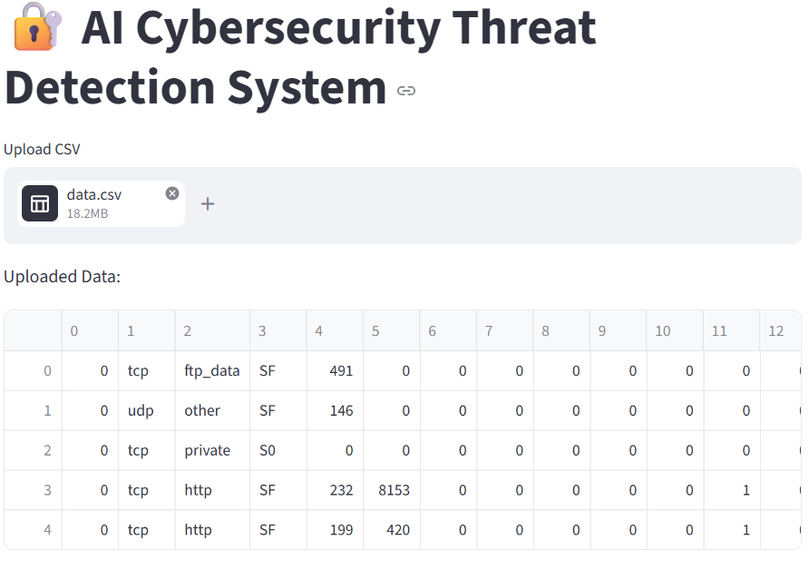
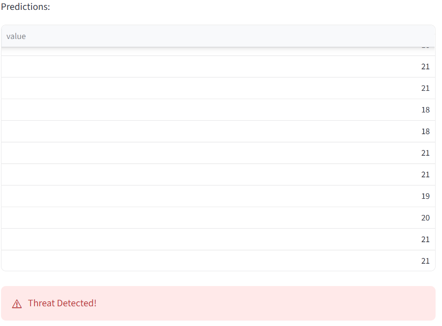
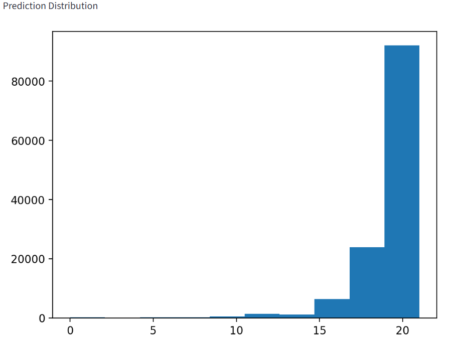

# 🔐 AI-Powered Cybersecurity Threat Detection System

---

## 📌 Project Overview
This project is an AI-based cybersecurity system that detects network threats using machine learning. It analyzes network traffic data and identifies malicious activities such as intrusion and attacks. The system simulates a real Security Operations Center (SOC) environment.

---

## ❗ Problem Statement
Cyber attacks are increasing rapidly, making it difficult to detect malicious activities in network traffic manually. Traditional rule-based systems fail to detect new and unknown threats. This project aims to build an AI-based system to automatically detect cyber threats using machine learning.

---

## 🌍 Industry Relevance
This project is highly relevant in industries like banking, IT, and cybersecurity where real-time threat detection is critical. It can be used in Security Operations Centers (SOC) for monitoring network activity and preventing cyber attacks.

---

## 🚀 Features
- Detects cyber threats using machine learning models
- Works on real-world network traffic dataset (NSL-KDD)
- Data preprocessing and feature engineering
- Model training and evaluation
- Real-time threat detection
- Interactive Streamlit dashboard
- Alert system for malicious activity

---

## 🧠 Tech Stack
- Python
- Pandas, NumPy
- Scikit-learn
- Streamlit
- Matplotlib
- Joblib

---

## 🏗 System Architecture
1. Data Collection (NSL-KDD dataset)
2. Data Preprocessing
3. Feature Engineering
4. Model Training (Random Forest)
5. Prediction & Anomaly Detection
6. Visualization using Streamlit Dashboard

---

```

## 📁 Project Structure

AI-Cybersecurity-Threat-Detection/
│
├── dashboard/
│   └── app.py
│
├── data/
│   └── KDDTrain+.txt
│
├── models/
│   └── model.pkl
│
├── src/
│   ├── load_data.py
│   ├── clean_data.py
│   ├── feature_engineering.py
│   ├── model.py
│   ├── predict.py
│   └── evaluate.py
│
├── notebooks/
│   └── EDA.ipynb
│
├── outputs/
│   └── results.txt
│
├── images/
│   └── dashboard.png
│
├── docs/
│   └── project_report.md
│
├── main.py
├── requirements.txt
├── .gitignore
└── README.md

```

---

## ⚙️ How to Run the Project

### 1. Install Dependencies
pip install -r requirements.txt

### 2. Run the Dashboard
python -m streamlit run dashboard/app.py

---

## 📊 Output
- Displays uploaded network data
- Shows predictions for each record
- Alerts if threat is detected
- Visualizes prediction results


---

## 📸 Screenshots

### 🔹 Dashboard UI


### 🔹 Threat Detection Alert


### 🔹 Visualization Graph


---

## 🎯 Use Cases
- Intrusion Detection Systems (IDS)
- Network Security Monitoring
- Cyber Threat Analysis
- SOC (Security Operations Center) Simulation

---

## 🎓 Learning Outcomes
- Understanding of machine learning in cybersecurity
- Data preprocessing and feature engineering
- Model training and evaluation
- Building interactive dashboards using Streamlit
- Real-world project development and GitHub usage

---

## 🧠 Key Concepts
- Machine Learning (Random Forest)
- Anomaly Detection
- Data Preprocessing
- Feature Engineering
- Model Deployment

---

## ⭐ Future Improvements
- Add deep learning models (LSTM, Autoencoders)
- Real-time packet capture integration
- API-based threat detection
- Advanced dashboard with analytics

---

## 👩‍💻 Author
- Saloni Keshkar

---